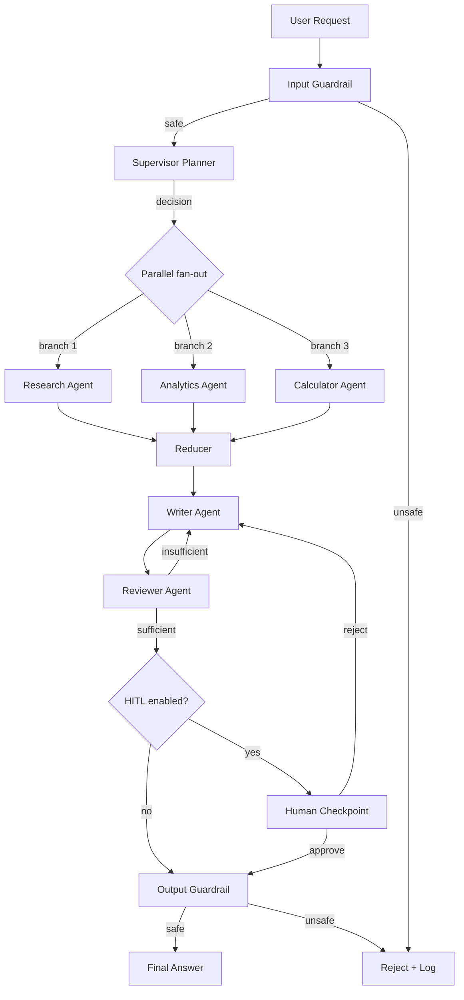
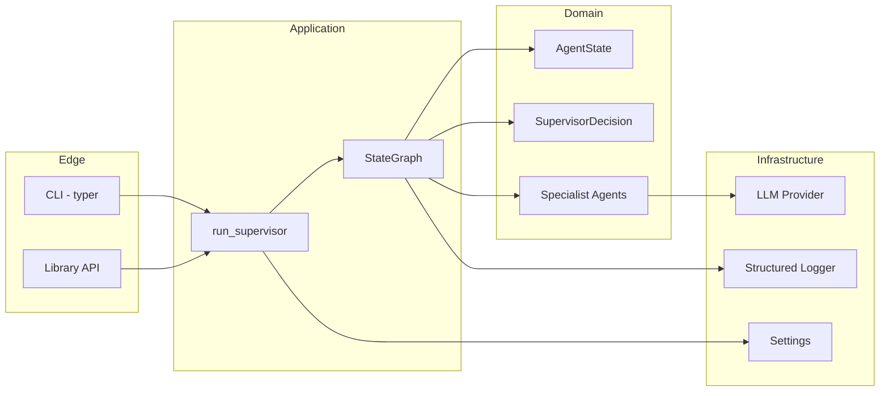
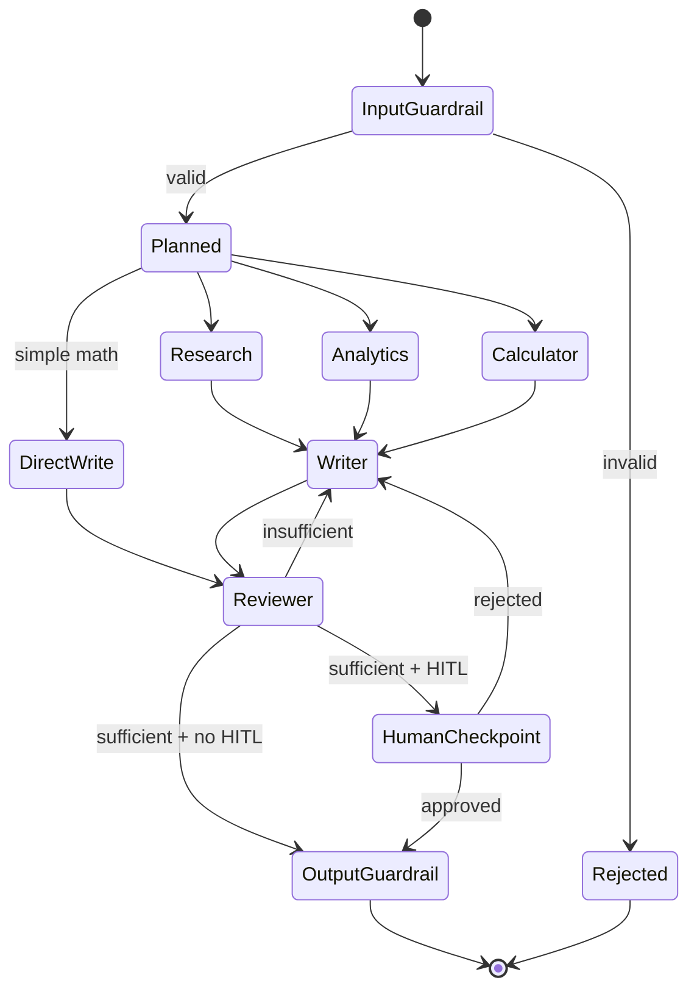

# Architecture

## Purpose

This document describes the architecture of the **Supervisor Agent**, a
production-grade reference implementation of the *Supervisor Pattern* for
multi-agent LLM systems.

The Supervisor is an orchestrator. It does not perform business logic. It
determines:

1. Which specialist agents should participate.
2. In what order they should execute.
3. Whether execution can be parallelised.
4. Whether additional work is required.
5. Whether the final answer is sufficient.

## High-level topology

## Components

| Component | Responsibility | Owns state? |
|---|---|---|
| `Input Guardrail` | Validate user input. Reject empty, oversized, or unsafe prompts. Emits structured reject reason. | No |
| `Supervisor` | Decide which agents run, in what order, in parallel or sequence. Produce `SupervisorDecision`. | Reads only |
| `Research Agent` | Information gathering, retrieval, search, fact collection. | Appends to `research_results` |
| `Analytics Agent` | KPI calculations, aggregations, metrics. | Appends to `analytics_results` |
| `Calculator Agent` | Mathematical evaluation via a safe AST-based tool. Never uses `eval()`. | Appends to `calculation_results` |
| `Writer Agent` | Produce draft report from upstream results. | Writes `report` |
| `Reviewer Agent` | Evaluate quality, completeness, consistency. Bounded reflection loop. | Writes `review_feedback`, increments `review_cycle` |
| `Output Guardrail` | Validate final answer length, content, structure before returning. | No |
| `Human Checkpoint` | Optional `interrupt`/`resume` for HITL approval. | Reads context, awaits command |
| `Recovery` | Per-agent retry, exponential backoff, fallback, escalation. | Counts `retries` |

## Layered view

## Dependencies

Production:

| Package | Purpose | Justification |
|---|---|---|
| `langgraph` | Graph runtime, `Send`, `interrupt` | Project-defining dependency. No equivalent stdlib alternative. |
| `pydantic` >=2 | Typed state, structured outputs, settings | Industry standard. Used by LangGraph itself. |
| `pydantic-settings` | Externalised configuration | First-party companion to `pydantic`. |
| `httpx` | OpenAI / Anthropic HTTP calls | Already a transitive dependency of LangChain. |
| `typer` | CLI | Built on `click`, type-annotated, low ceremony. |
| `rich` | Pretty console output for CLI | Stdlib `print` is insufficient for tabular agent output. |
| `structlog` | Structured JSON logging | De-facto standard for JSON logs in Python. |
| `python-dotenv` | `.env` loading for local dev | Tiny, ubiquitous, no replacement. |

Test-only:

| Package | Purpose | Justification |
|---|---|---|
| `pytest` | Test runner | Standard. |
| `pytest-asyncio` | Async graph execution | Required for LangGraph async API. |
| `pytest-cov` | Coverage reporting | Standard. |
| `respx` | Mock `httpx` for provider tests | Lighter than spinning up a wiremock server. |
| `freezegun` | Deterministic time in reflection tests | Tiny. |

Lint / type:

| Package | Purpose |
|---|---|
| `ruff` | Linter + formatter |
| `black` | Formatter (kept for compatibility with ecosystem) |
| `mypy` | Static type checker |

## State transitions

`AgentState` is a `TypedDict` with reducer functions. The graph mutates a
single instance throughout execution; LangGraph persists it via the configured
checkpointer.

## Failure modes

| Mode | Detection | Recovery |
|---|---|---|
| Invalid input | Input guardrail regex/length check | Return `Rejected` with reason. No graph crash. |
| Specialist exception | Node try/except wrapper | Retry up to `agent_max_retries`. Fallback agent if configured. Escalate to safe error message. |
| Provider timeout | `httpx` `TimeoutException` | Exponential backoff. If exhausted, raise `ProviderUnavailable` and fall back to the `fake` provider if `allow_degradation=true`. |
| Malformed structured output | Pydantic `ValidationError` on `SupervisorDecision` | One re-prompt. On second failure, use a deterministic heuristic router. |
| Reflection divergence | `review_cycle > max_review_cycles` | Accept current draft, mark with `review_status=forced_complete`, log warning. |
| Human never responds | Checkpoint timeout | Configurable; default = 30 minutes. After timeout, fall back to non-HITL path. |

## Recovery strategies

* **Retry with backoff** at the agent level.
* **Degradation** by falling back from a paid provider to the offline `fake`
  provider when configured.
* **Bounded reflection** prevents infinite Writer/Reviewer loops.
* **Hard guardrails** at input and output keep the system from emitting unsafe
  or unbounded content.
* **Observability**: every failure emits a structured log record with
  `trace_id`, `request_id`, `agent`, `attempt`, `duration_ms`, `error_class`.

## Out of scope (v0.1.0)

* Persistent checkpoints across processes (MemorySaver only).
* Web search tools (Research agent operates on a static corpus for the
  reference implementation; pluggable interface defined).
* Multi-tenant isolation.
* Streaming token output (final answer only).

See [`docs/Roadmap.md`](Roadmap.md) for the next-step plan.
