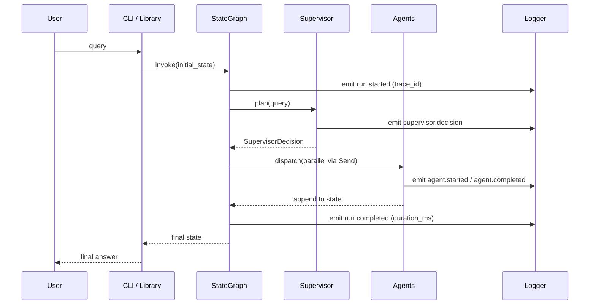

# Dataflow

This document traces a single request through the Supervisor. It complements
[`Architecture.md`](Architecture.md) by describing *what flows where*, not just
*what components exist*.

## Object lifecycle



## State shape

```python
class AgentState(TypedDict, total=False):
    # Identity
    query: str
    request_id: str
    trace_id: str

    # Supervisor plan
    selected_agents: list[str]
    execution_order: list[str]
    requires_parallel_execution: bool
    supervisor_reasoning: str

    # Execution
    completed_agents: list[str]
    research_results: Annotated[list[ResearchResult], operator.add]
    analytics_results: Annotated[list[AnalyticsResult], operator.add]
    calculation_results: Annotated[list[CalculationResult], operator.add]

    # Reflection
    report: str
    review_feedback: str
    review_cycle: int
    review_status: Literal["pending", "sufficient", "forced_complete"]

    # Output
    final_answer: str
    rejection_reason: str | None

    # Telemetry
    started_at: float
    completed_at: float
    metadata: dict[str, Any]
    error: str | None
```

`Annotated[list[T], operator.add]` is the LangGraph idiom for state reducers.
It guarantees parallel branches append rather than overwrite.

## Trace propagation

A single `trace_id` is minted by the `run_supervisor` entry point and stored
in the state. Every log record and every LLM call carries the same
`trace_id`. This makes end-to-end correlation trivial in any log aggregator.

## Failure cascade

If the Supervisor itself fails to plan (e.g. provider timeout on
`structured_output`), the entry point catches the exception, records
`error="supervisor_planning_failed"`, and emits a `final_answer` that
gracefully explains the failure. The graph never raises an unhandled
exception to the caller.

## Concurrency

Parallel execution uses LangGraph's `Send`:

```python
graph.add_conditional_edges(
    "supervisor",
    lambda s: [Send(agent, s) for agent in s["execution_order"]],
    ["research", "analytics", "calculator"],
)
```

Each branch returns a partial state delta; LangGraph merges them through the
declared reducers. `MAX_PARALLEL_AGENTS` is enforced by the planner, not by
the runtime, to keep state merging deterministic.
