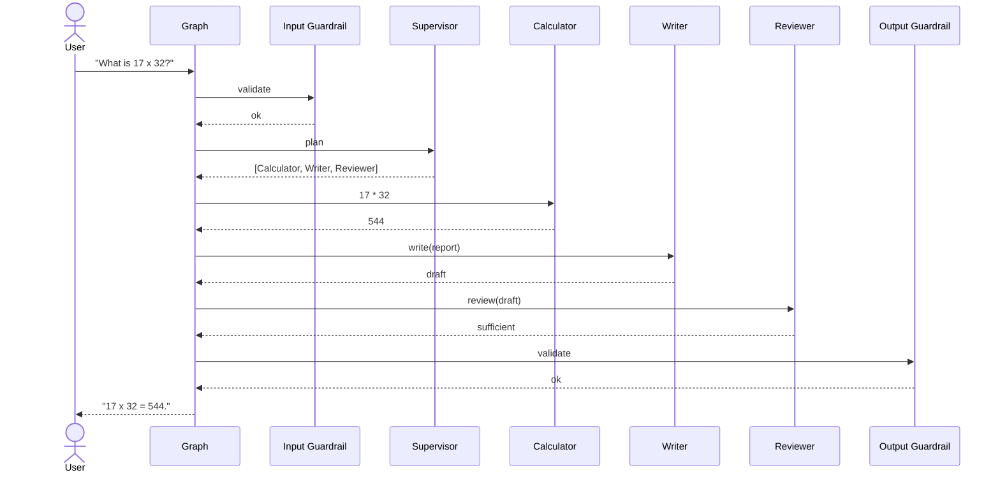
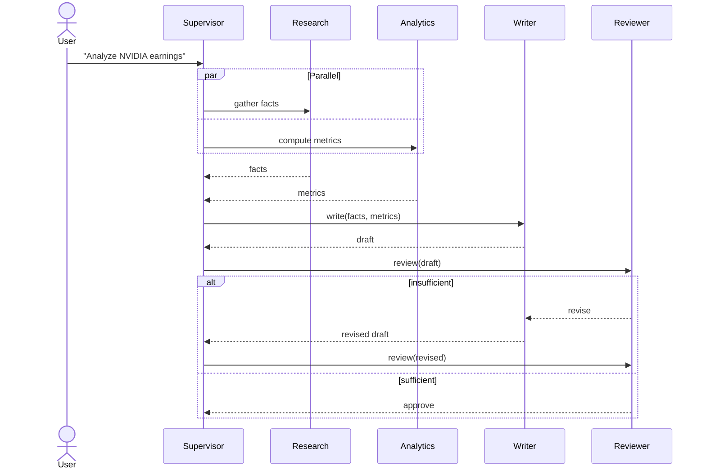
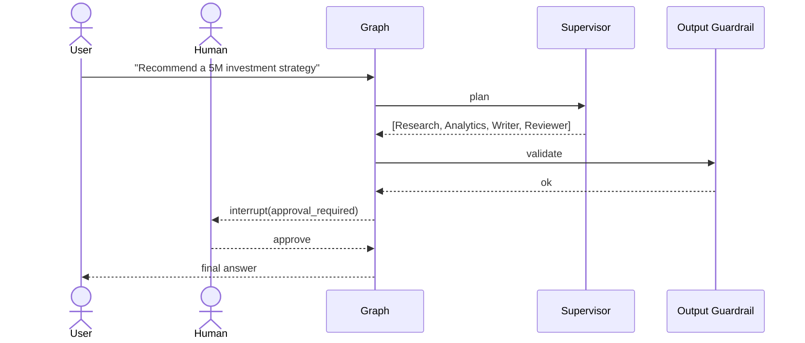
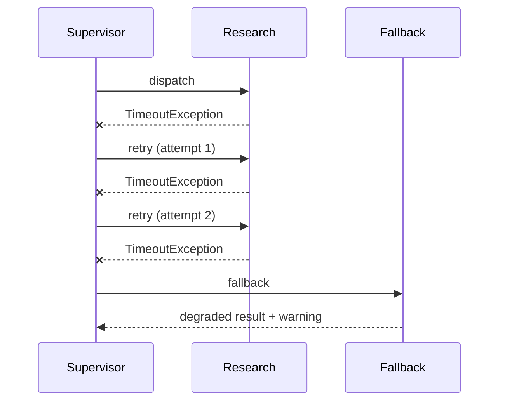

# Sequence Diagrams

## 1. Simple request (single Calculator)

```mermaid
sequenceDiagram
    actor U as User
    participant G as Graph
    participant I as Input Guardrail
    participant S as Supervisor
    participant C as Calculator
    participant W as Writer
    participant R as Reviewer
    participant O as Output Guardrail

    U->>G: "What is 17 x 32?"
    G->>I: validate
    I-->>G: ok
    G->>S: plan
    S-->>G: [Calculator, Writer, Reviewer]
    G->>C: 17 * 32
    C-->>G: 544
    G->>W: write(report)
    W-->>G: draft
    G->>R: review(draft)
    R-->>G: sufficient
    G->>O: validate
    O-->>G: ok
    G-->>U: "17 x 32 = 544."
```

## 2. Comprehensive report (parallel research + analytics)

```mermaid
sequenceDiagram
    actor U as User
    participant S as Supervisor
    participant R as Research
    participant A as Analytics
    participant W as Writer
    participant Rv as Reviewer

    U->>S: "Analyze NVIDIA earnings"
    par Parallel
        S->>R: gather facts
    and
        S->>A: compute metrics
    end
    R-->>S: facts
    A-->>S: metrics
    S->>W: write(facts, metrics)
    W-->>S: draft
    S->>Rv: review(draft)
    alt insufficient
        Rv-->>W: revise
        W-->>S: revised draft
        S->>Rv: review(revised)
    else sufficient
        Rv-->>S: approve
    end
```

## 3. Human-in-the-loop

```mermaid
sequenceDiagram
    actor U as User
    actor H as Human
    participant G as Graph
    participant S as Supervisor
    participant O as Output Guardrail

    U->>G: "Recommend a 5M investment strategy"
    G->>S: plan
    S-->>G: [Research, Analytics, Writer, Reviewer]
    G->>O: validate
    O-->>G: ok
    G-->>H: interrupt(approval_required)
    H-->>G: approve
    G-->>U: final answer
```

## 4. Failure recovery

```mermaid
sequenceDiagram
    participant S as Supervisor
    participant R as Research
    participant F as Fallback
    S->>R: dispatch
    R--xS: TimeoutException
    S->>R: retry (attempt 1)
    R--xS: TimeoutException
    S->>R: retry (attempt 2)
    R--xS: TimeoutException
    S->>F: fallback
    F-->>S: degraded result + warning
```
